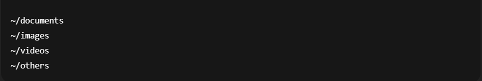

# CLI File System Organizer

A simple Node.js CLI tool that organizes files inside a user-specified directory, useful for cleaning messy folders full of mixed files.
It automatically detects file types based on extensions and moves them into categorized folders inside your home directory:
/documents
/images
/videos
/others

## Features

- Asks the user for a directory path
- Validates that the path exists and is a directory
- Organizes files by extension:
  Documents → .pdf, .docx, .txt, .xlsx
  Images → .jpg, .png, .gif, .svg, etc.
  Videos → .mp4, .mkv, .avi, etc.
  Everything else → moved into others
- Creates destination folders automatically if they don't exist
- Runs safely and interactively

## How It Works
1. The script asks for a folder path.
2. If the path is invalid or not a directory it asks again.
3. It reads all files inside that folder.
4. Depending on the file extension it moves each file to appropriate folder

## Folder Structure Created

The script creates these folders inside your home directory:

## Supported Extensions

- Document Extensions
  .pdf, .docx, .txt, .xlsx

- Image Extensions
  .apng, .png, .avif, .gif, .jpg, .jpeg, .jfif, .pjpeg, .pjp, .svg, .webp

- Video Extensions
  .mp4, .mov, .wmv, .avi, .mkv, .webm, .flv, .m4v, .mpeg, .mpg

- All other files will be placed in /others folder

## How To Run

1. Install Node.js(16+ recommended)
2. Clone this repository
3. Run the script using node index.js
4. When prompted:
   Please give the path:
   Enter the path to the direcotry you want to organize, for example:
   C:\Users\Name\Desktop\folder

